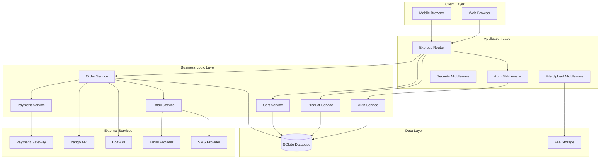

# Design Document

## Overview

AfriGlam is designed as a full-stack e-commerce platform using Node.js/Express.js backend with EJS templating for server-side rendering. The architecture follows MVC patterns with clear separation of concerns, integrating external services for payments and delivery logistics. The system prioritizes security, scalability, and user experience across both customer and administrative interfaces.

## Architecture

### System Architecture



### Technology Stack

- **Backend**: Node.js with Express.js framework
- **Database**: SQLite with better-sqlite3 driver
- **Templating**: EJS for server-side rendering
- **Authentication**: JWT tokens with bcrypt password hashing
- **File Upload**: Multer middleware for product images
- **Payment**: Integration with payment gateway APIs
- **Notifications**: Email and SMS service integration
- **Delivery**: Yango and Bolt API integration

## Components and Interfaces

### Authentication System

**Components:**
- `AuthService`: Handles user registration, login, and JWT token management
- `Auth Middleware`: Validates JWT tokens and manages session state
- `Security Middleware`: Implements rate limiting and input sanitization

**Key Methods:**
```javascript
// AuthService interface
class AuthService {
    async register(userData) // Creates new user account
    async login(credentials) // Authenticates user and returns JWT
    async verifyToken(token) // Validates JWT token
    async hashPassword(password) // Encrypts password with bcrypt
    async comparePassword(password, hash) // Verifies password
}
```

### Product Management System

**Components:**
- `ProductService`: CRUD operations for products and categories
- `Product Upload Handler`: Manages product image uploads
- `Inventory Manager`: Tracks stock levels and availability

**Key Methods:**
```javascript
// ProductService interface
class ProductService {
    async createProduct(productData, images) // Creates new product
    async updateProduct(id, productData) // Updates existing product
    async deleteProduct(id) // Soft deletes product
    async getProducts(filters, pagination) // Retrieves filtered products
    async getProductById(id) // Gets single product details
    async updateStock(id, quantity, operation) // Manages inventory
}
```

### Shopping Cart System

**Components:**
- `CartService`: Manages cart operations and persistence
- `Cart Session Handler`: Maintains cart state across sessions
- `Stock Validator`: Ensures cart items are available

**Key Methods:**
```javascript
// CartService interface
class CartService {
    async addToCart(userId, productId, quantity, options) // Adds item to cart
    async updateCartItem(userId, itemId, quantity) // Updates cart item
    async removeFromCart(userId, itemId) // Removes cart item
    async getCart(userId) // Retrieves user's cart
    async clearCart(userId) // Empties cart after checkout
    async validateCartStock(userId) // Checks item availability
}
```

### Order Processing System

**Components:**
- `OrderService`: Handles order lifecycle management
- `Checkout Handler`: Processes order creation and payment
- `Order Status Manager`: Updates and tracks order progress

**Key Methods:**
```javascript
// OrderService interface
class OrderService {
    async createOrder(userId, cartItems, addressData) // Creates new order
    async updateOrderStatus(orderId, status) // Updates order status
    async getOrderById(orderId) // Retrieves order details
    async getUserOrders(userId) // Gets user's order history
    async getAdminOrders(filters) // Gets orders for admin view
    async cancelOrder(orderId) // Cancels order and restores stock
}
```

### Payment Integration System

**Components:**
- `PaymentService`: Integrates with payment gateways
- `Payment Validator`: Validates payment data and responses
- `Refund Handler`: Processes refund requests

**Key Methods:**
```javascript
// PaymentService interface
class PaymentService {
    async processPayment(orderData, paymentData) // Processes payment
    async verifyPayment(transactionId) // Verifies payment status
    async initiateRefund(orderId, amount) // Processes refunds
    async getPaymentMethods() // Returns available payment options
}
```

### Notification System

**Components:**
- `EmailService`: Handles email notifications
- `SMSService`: Manages SMS notifications
- `NotificationQueue`: Queues and processes notifications

**Key Methods:**
```javascript
// EmailService interface
class EmailService {
    async sendOrderConfirmation(orderData, customerEmail) // Order confirmation
    async sendStatusUpdate(orderData, customerEmail) // Status updates
    async sendAdminNotification(orderData) // Admin notifications
    async sendPaymentConfirmation(paymentData, customerEmail) // Payment confirmation
}
```

### Delivery Integration System

**Components:**
- `DeliveryService`: Integrates with Yango and Bolt APIs
- `Address Formatter`: Formats addresses for delivery services
- `Tracking Manager`: Updates delivery status

**Key Methods:**
```javascript
// DeliveryService interface
class DeliveryService {
    async scheduleDelivery(orderData, deliveryService) // Schedules delivery
    async getDeliveryQuote(addressData) // Gets delivery pricing
    async trackDelivery(trackingId) // Tracks delivery status
    async updateDeliveryStatus(orderId, status) // Updates delivery status
}
```

## Data Models

### User Model
```sql
CREATE TABLE users (
    id INTEGER PRIMARY KEY AUTOINCREMENT,
    email VARCHAR(255) UNIQUE NOT NULL,
    password_hash VARCHAR(255) NOT NULL,
    first_name VARCHAR(100) NOT NULL,
    last_name VARCHAR(100) NOT NULL,
    phone VARCHAR(20),
    role ENUM('customer', 'admin') DEFAULT 'customer',
    created_at DATETIME DEFAULT CURRENT_TIMESTAMP,
    updated_at DATETIME DEFAULT CURRENT_TIMESTAMP
);
```

### Product Model
```sql
CREATE TABLE products (
    id INTEGER PRIMARY KEY AUTOINCREMENT,
    name VARCHAR(255) NOT NULL,
    description TEXT,
    price DECIMAL(10,2) NOT NULL,
    category_id INTEGER,
    stock_quantity INTEGER DEFAULT 0,
    sizes JSON, -- ['S', 'M', 'L', 'XL']
    colors JSON, -- ['Red', 'Blue', 'Green']
    images JSON, -- ['image1.jpg', 'image2.jpg']
    is_active BOOLEAN DEFAULT 1,
    created_at DATETIME DEFAULT CURRENT_TIMESTAMP,
    updated_at DATETIME DEFAULT CURRENT_TIMESTAMP,
    FOREIGN KEY (category_id) REFERENCES categories(id)
);
```

### Order Model
```sql
CREATE TABLE orders (
    id INTEGER PRIMARY KEY AUTOINCREMENT,
    user_id INTEGER NOT NULL,
    order_number VARCHAR(50) UNIQUE NOT NULL,
    total_amount DECIMAL(10,2) NOT NULL,
    status ENUM('pending', 'paid', 'processing', 'shipped', 'delivered', 'cancelled') DEFAULT 'pending',
    payment_status ENUM('pending', 'completed', 'failed', 'refunded') DEFAULT 'pending',
    delivery_address JSON NOT NULL, -- {street, city, region, postal_code}
    customer_phone VARCHAR(20) NOT NULL,
    delivery_service VARCHAR(50), -- 'yango', 'bolt', 'other'
    tracking_id VARCHAR(100),
    created_at DATETIME DEFAULT CURRENT_TIMESTAMP,
    updated_at DATETIME DEFAULT CURRENT_TIMESTAMP,
    FOREIGN KEY (user_id) REFERENCES users(id)
);
```

### Cart Model
```sql
CREATE TABLE cart_items (
    id INTEGER PRIMARY KEY AUTOINCREMENT,
    user_id INTEGER NOT NULL,
    product_id INTEGER NOT NULL,
    quantity INTEGER NOT NULL DEFAULT 1,
    selected_size VARCHAR(10),
    selected_color VARCHAR(50),
    created_at DATETIME DEFAULT CURRENT_TIMESTAMP,
    FOREIGN KEY (user_id) REFERENCES users(id),
    FOREIGN KEY (product_id) REFERENCES products(id)
);
```

### Address Model
```sql
CREATE TABLE user_addresses (
    id INTEGER PRIMARY KEY AUTOINCREMENT,
    user_id INTEGER NOT NULL,
    address_type ENUM('home', 'work', 'other') DEFAULT 'home',
    street_address VARCHAR(255) NOT NULL,
    city VARCHAR(100) NOT NULL,
    region VARCHAR(100) NOT NULL,
    postal_code VARCHAR(20),
    is_default BOOLEAN DEFAULT 0,
    created_at DATETIME DEFAULT CURRENT_TIMESTAMP,
    FOREIGN KEY (user_id) REFERENCES users(id)
);
```

### Payment Model
```sql
CREATE TABLE payments (
    id INTEGER PRIMARY KEY AUTOINCREMENT,
    order_id INTEGER NOT NULL,
    payment_method VARCHAR(50) NOT NULL, -- 'card', 'mobile_money', etc.
    transaction_id VARCHAR(100) UNIQUE,
    amount DECIMAL(10,2) NOT NULL,
    status ENUM('pending', 'completed', 'failed', 'refunded') DEFAULT 'pending',
    gateway_response JSON,
    created_at DATETIME DEFAULT CURRENT_TIMESTAMP,
    FOREIGN KEY (order_id) REFERENCES orders(id)
);
```

## Error Handling

### Error Categories

1. **Authentication Errors**: Invalid credentials, expired tokens, unauthorized access
2. **Validation Errors**: Invalid input data, missing required fields
3. **Business Logic Errors**: Insufficient stock, invalid operations
4. **External Service Errors**: Payment gateway failures, delivery API errors
5. **System Errors**: Database connection issues, file upload failures

### Error Response Format
```javascript
{
    success: false,
    error: {
        code: 'ERROR_CODE',
        message: 'User-friendly error message',
        details: 'Technical details for debugging',
        timestamp: '2024-01-01T00:00:00Z'
    }
}
```

### Error Handling Strategy

- **Global Error Handler**: Catches unhandled errors and provides consistent responses
- **Validation Middleware**: Validates input data before processing
- **Service Layer Error Handling**: Each service handles its specific error types
- **External Service Resilience**: Retry mechanisms and fallback options
- **Logging**: Comprehensive error logging for debugging and monitoring

## Testing Strategy

### Unit Testing
- **Service Layer Tests**: Test business logic in isolation
- **Utility Function Tests**: Test helper functions and validators
- **Model Tests**: Test data model operations and constraints

### Integration Testing
- **API Endpoint Tests**: Test complete request/response cycles
- **Database Integration Tests**: Test database operations and transactions
- **External Service Integration Tests**: Test payment and delivery integrations

### End-to-End Testing
- **User Journey Tests**: Test complete user workflows
- **Admin Workflow Tests**: Test administrative operations
- **Cross-browser Testing**: Ensure compatibility across browsers

### Testing Tools and Framework
- **Jest**: Primary testing framework for unit and integration tests
- **Supertest**: HTTP assertion library for API testing
- **Test Database**: Separate SQLite database for testing
- **Mock Services**: Mock external APIs for reliable testing

### Test Coverage Goals
- **Service Layer**: 90%+ code coverage
- **API Routes**: 85%+ code coverage
- **Critical Paths**: 100% coverage for payment and order processing
- **Error Scenarios**: Comprehensive error condition testing

The design ensures scalability, maintainability, and security while providing a seamless experience for both customers and administrators. The modular architecture allows for easy extension and integration of additional features as the platform grows.